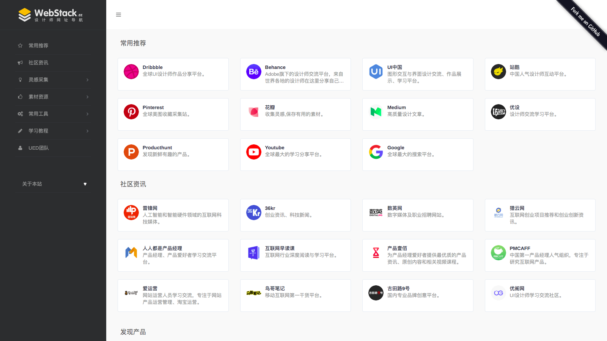

# WebStack-Laravel

一个开源的网址导航网站项目，具备完整的前后台，您可以拿来制作自己的网址导航。



## 测试


## 部署

daoker 部署
```shell
docker run --name dao8024 -d -p 8024:8000 -e DB_HOST=192.168.0.68 -e DB_DATABASE=nav  -e DB_USERNAME=nav  -e DB_PASSWORD=nav@2023  -e APP_URL=https://123.lingduquan.com -e APP_NAME=chatGPT    -v /data/app/navi:/opt/navi arvon2014/webstack-laravel:v1.2.2    /entrypoint.sh server
```
daoker 本地 部署

```shell
docker run --name dao8024 -d -p 8024:8000 -e DB_HOST=172.17.0.1 -e DB_DATABASE=nav  -e DB_USERNAME=cikuu  -e DB_PASSWORD=cikuutest! -e APP_URL=https://123.lingduquan.com -e APP_NAME=chatGPT   -v /Users/wulin/Documents/yangdaorong/www/123.daohang.com/navi:/opt/navi arvon2014/webstack-laravel:v1.2.2    /entrypoint.sh server
```

docker run --name dao -d -p 8023:8000 -e DB_HOST=172.17.0.1 -e DB_DATABASE=nav  -e DB_USERNAME=cikuu  -e DB_PASSWORD=cikuutest!   arvon2014/webstack-laravel:v1.2.2    /entrypoint.sh server

 
安装依赖：

```shell
$ composer install
```

编辑配置：

```
$ cp .env.example .env
```

```
...
DB_DATABASE=database
DB_USERNAME=username
DB_PASSWORD=password
...
```

生成 KEY：

```shell
$ php artisan key:generate  
```

迁移数据：

```shell
php artisan migrate:refresh --seed
```

开启服务：

```shell
$ php artisan serve
```

安装完成：http://127.0.0.1:8000


## 使用

后台地址：http://domain/admin

默认用户：admin

默认密码：admin


## 感谢

前端设计：[**WebStackPage**](https://github.com/WebStackPage/WebStackPage.github.io)

后台框架：[**laravel-admin**](https://github.com/z-song/laravel-admin)


## License

MIT
